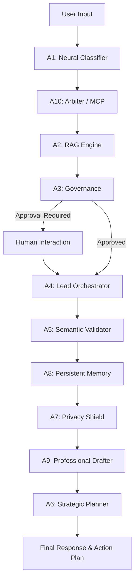

# 🏗 Arfanity Core Orchestrator: System Architecture v3.5-PROD

## 🌌 High-Level Design
Arfanity follows a **Neural Multi-Agent** architecture where the Frontend and Backend are decoupled yet synchronized via a shared Mission State and persistent thread memory.

### The Stack:
- **Client**: React 19 + Framer Motion (Glassmorphic UI)
- **Data Server**: Node.js / Express (Document Lifecycle & JSON DB)
- **Engine**: Python 3.11+ + FastAPI (LangGraph Orchestration & Neural Cells)
- **Persistence**: LangGraph Checkpointer (MemorySaver)

---

## ⚡ The Mission Flow (LangGraph)
The core of the system is a **Stateful Directed Graph** implemented via `langgraph`.

### Framework Responsibilities:
- **LangChain**: Governs the **Cognition** of each agent via chain composition and output parsing.
- **LangGraph**: Governs the **State & Persistence**. It manages thread IDs, mission checkpoints, and cyclic handovers.
- **MCP (Model Context Protocol)**: Governs the **Universal Tools**. It provides a standardized data bridge to any external enterprise silo.
- **LangSmith**: Governs **Observability**. Full trace visualization for every neural node execution.

---

## 🛡 Security & Privacy Model
The v3.5-PROD system implements a **Neural Defense-in-Depth** strategy:
1. **Classifier (Neural)**: Performs early detection of adversarial intent or high-risk requests.
2. **Governance (HITL)**: Mandatory pause for manual authentication on sensitive operations.
3. **Validator (Semantic)**: Prevents data leaks via hallucinations by enforcing context grounding.
4. **Privacy Shield (Scrubbing)**: Final PII/Secret redaction layer powered by neural detection.

---
*Arfanity Core Orchestrator v3.5-PROD Architecture Deep Dive*
